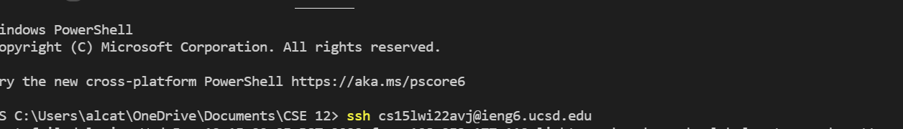

# Lab Report 1
---
# VScode Installation
  


* To start off this tutorial you need to [download VScode](https://code.visualstudio.com/), and it is an Integrated Development Environment where one can edit code.
* Simply click on download to download the application or the dropdown depending on your operating sytem.
* Then, run the installer and follow the instructions to fully install it on your computer.
# Remotely Connecting (SSH)
  


* You will first need to [reset the password for your course account](https://sdacs.ucsd.edu/~icc/index.php) in the link above before anything else to enable your account in order to secure shell.
* If you are on Windows you will need to follow [this tutorial](https://docs.microsoft.com/en-us/windows-server/administration/openssh/openssh_install_firstuse) which tells you to install two programs called open ssh client and server.
* Next you will want to remotely connect to the server, a remote computer.
* Enter the command:
```
 ssh (Your username)@(Hostname)
```
* Notice that you may be prompted about authenticity when connecting for the first time and you should enter yes.
# Running Some Commands

* The next order of business is running commands or instructions for the computer.
* As you can see in the image some starter commands include:
```
 ls
 cat
 cd
 exit
```
* Commands are ran by typing in the keyword sometimes followed by an argument separated by a space.
# Moving Files (scp)

* If you want to move files from your computer, the client, to the server you can use the secure copy
command.
* If you do not have secure shell keys you will need to enter your password for your course account.
* The command is:
```
 scp (local file) (Your username)@(Hostname):(desired directory location)
```
# SSH Keys


* To get SSH keys you first need to run the 
```
ssh-keygen
```
 command which will generate two files, one for the client and one for the server designated as public, server, and private, client.
* Then you fill out the prompts and observe: where to store the public and private keys which are files (The overwrite prompt is there because I have already done this so it can be ignored), a passphrase for the keys, and then notice the information generated for your keys.
* To complete the process you need to login to your account, make an secure shell directory for the public key, and logout to your local computer to secure copy
the public key onto the server which will complete the process as the private key is only needed by the client.
# Becoming Efficient in the Remote Environment


* There are a myriad of tricks to optimize your remote running but a good start is using some basic ideas.
* These tricks include seperating commands with a
semicolon on one line to do multiple commands in one go, you can couple this with attaching arguments to the secure shell command, using keyboard shortcuts such as tab to finish arguments for you, and having an ssh key so you do not need to enter your password everytime you secure shell or secure copy.
* An implementation of this would be to make coding java on a server a lot easier by on the same line logging into the server, compiling, running, and showing the contents of the file in one line before returning to the local computer.
This command would be:
```
ssh cs15lwi22avj@ieng6.ucsd.edu "javac WhereAmI.java; java WhereAmI; cat WhereAmI.java"
```
 * This process would be 87 keystrokes.
