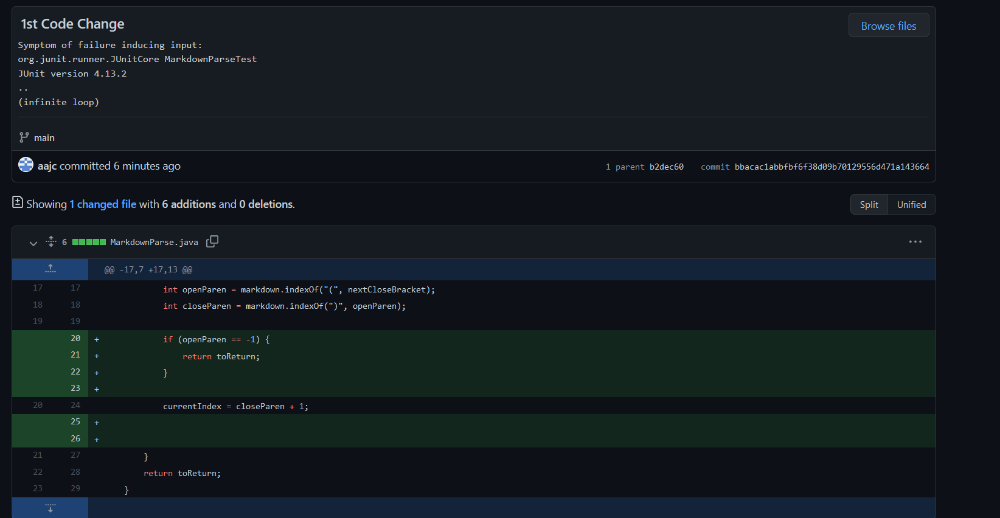

# Fixing a Bug
## Code Change 1

[Test file with failure-inducing input](https://github.com/aajc/markdown-parse/blob/main/test-file3.md)

The bug is that the MarkdownParse program does not account for markdown files without parenthesis after the closing bracket. The symptom is an infinite loop with the failure inducing input of a markdown file with square brackets but no parenthesis after it. The relationship between these three entities is that the bug is enabled by the failure inducing input while the bug produces the symptoms so the bug.

## Code Change 2

[Test file with failure-inducing input](https://github.com/aajc/markdown-parse/blob/main/test-file3.md)

The bug is that the MarkdownParse program does not account for markdown files without parenthesis after the closing bracket. The symptom is an infinite loop with the failure inducing input of a markdown file with square brackets but no parenthesis after it. The relationship between these three entities is that the bug is enabled by the failure inducing input while the bug produces the symptoms so the bug.

## Code Change 3

[Test file with failure-inducing input](https://github.com/aajc/markdown-parse/blob/main/test-file3.md)

The bug is that the MarkdownParse program does not account for markdown files without parenthesis after the closing bracket. The symptom is an infinite loop with the failure inducing input of a markdown file with square brackets but no parenthesis after it. The relationship between these three entities is that the bug is enabled by the failure inducing input while the bug produces the symptoms so the bug.