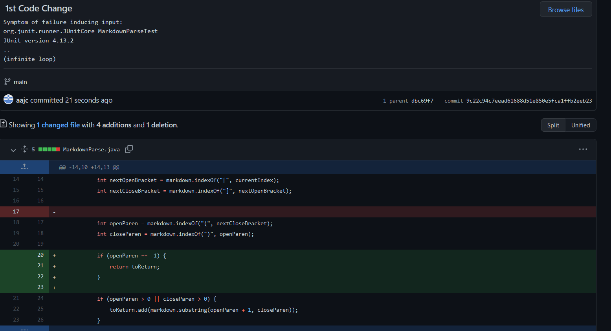
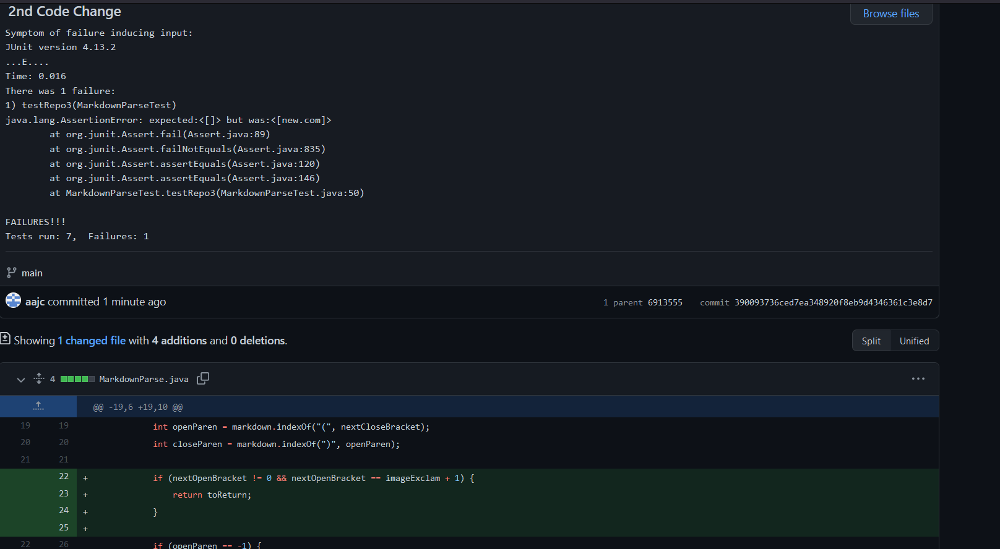

# Lab Report 2
## Code Change 1

[Test file with failure-inducing input](https://github.com/aajc/markdown-parse/blob/main/test-file4.md)

The bug is that the program does not account for markdown files without parentheses after the closing bracket while the symptom is an infinite loop. The failure inducing input is a markdown file with square brackets but no parenthesis after it. The relationship between these three entities is that the bug is enabled by the failure inducing input but enables the symptoms. Also, the symptom, an infinite loop, is a visible manifestation of the while loop bug of repeatedly checking for parenthesis and finding nothing.

## Code Change 2

[Test file with failure-inducing input](https://github.com/aajc/markdown-parse/blob/main/test-file6.md)

The bug is that an image in markdown is mistaken for a link, and the symptom is returning the insides of the image as if it was a link. The failure inducing input is a markdown file that should cause an output of an empty ArrayList and has the syntax for an image. The relationship between these three entities is that the symptom of a non-empty arraylist shows the bug of not being able to discern between a link and an image and the failure-inducing input is a normal file that makes the bug come out which makes the symptom come out.

## Code Change 3

[Test file with failure-inducing input](https://github.com/aajc/markdown-parse/blob/main/test-file5.md)

The bug is that the program does not check if the brackets are next to the parenthesis and the symptom is that the link will print out even though it is not a valid markdown link. The failure inducing input is a file where the link in parentheses is 2 lines down from the bracket but after. The relationship here is the symptom appearing normal so as to make the bug harder to notice as there is no error. The failure inducing input is not meant to work and so its goal is to produce a bug which it does; the failure inducing input is what exposes the bug in this situation.