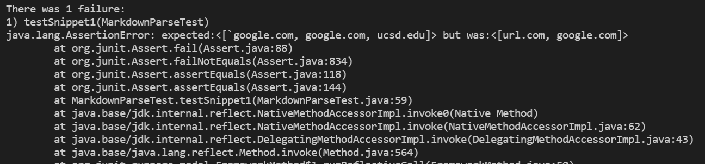
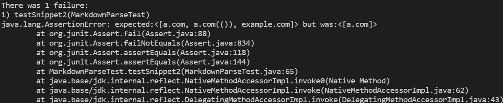
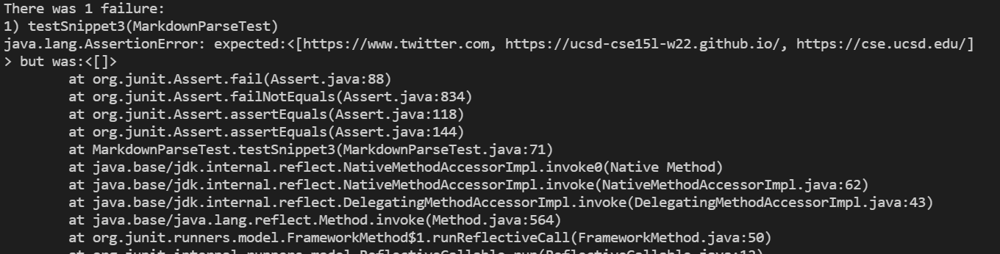

# Lab Report 4

My markdown-parse repository: 
[My repo](https://github.com/aajc/markdown-parse)

Reviewed markdown-parse repository: 
[Other Repo](https://github.com/tanpatil/markdown-parse)

## Snippet 1

### My repository
My repository test for snippet 1 based off the VScode preview should produce [`google.com, google.com, ucsd.edu].

My implementation did not pass.

I think there is a small change that will fix cases with inline code with backticks. One would only need a short if statement to find the opening and closing backticks and then would only need to ignore that part of the algorithm.

### Reviewed repository
My repository test for snippet 1 based off the VScode preview should produce [`google.com, google.com, ucsd.edu].

The reviewed repository implementation did not pass.

I think there is not a small change that will fix cases with inline code with backticks for this implementation of markdown-parse. This is a complex program with regex and other advanced techniques which complicates the program so one would likely need to change much of the program in addition to the if statement checking for backticks.

## Snippet 2

### My repository
My repository test for snippet 2 based off the VScode preview should produce [a.com, a.com(()), example.com].

My implementation did not pass.

I think there is not a small change that will fix cases with nested special characters such as parentheses and brackets. It is more of an involved challenge because one does not know how many extra parenthesis and other special characters there are which makes it difficult to tell when to start and stop the link. It would need to be a smart program that checks for the last parenthesis and find the first parenthesis and then make the link which would take over ten lines most likely.

### Reviewed repository
My repository test for snippet 2 based off the VScode preview should produce [a.com, a.com(()), example.com].

The reviewed repository implementation did not pass.

I think there is not a small change that will fix cases with nested special characters such as parentheses and brackets. This program uses a regex and checks a specific pattern. In order to get the desired functionality one would likely need to redo the functionality of the method which would be over ten lines.

## Snippet 3

### My repository
My repository test for snippet 1 based off the VScode preview should produce [https://www.twitter.com, https://ucsd-cse15l-w22.github.io/, https://cse.ucsd.edu/].

My implementation did not pass.

I think there is a small change that will make my program work for snippet3 and all related cases with newlines. The most needed change for my program would be a check for closingParen being -1 or it not existing and newlines in brackets and parenthesis should not break the program.

### Reviewed repository
The reviewed repository test for snippet 3 based off the VScode preview should produce [https://www.twitter.com, https://ucsd-cse15l-w22.github.io/, https://cse.ucsd.edu/].

My implementation did not pass.

I think there is a small change that will make my program work for snippet3 and all related cases with newlines. The most important code change would be modifying the way the if statement checks for the links. It checks to see if the parenthesis is one index after the closing bracket so modifying this if statement to keep in mind of newline characters and whitespace in between.