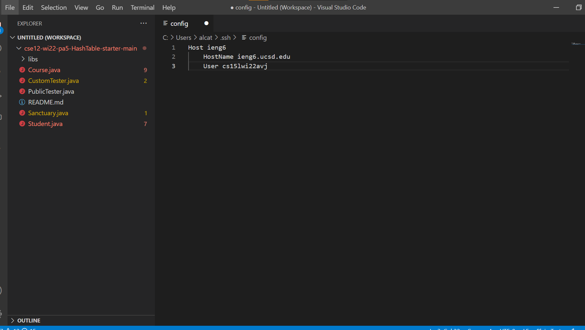
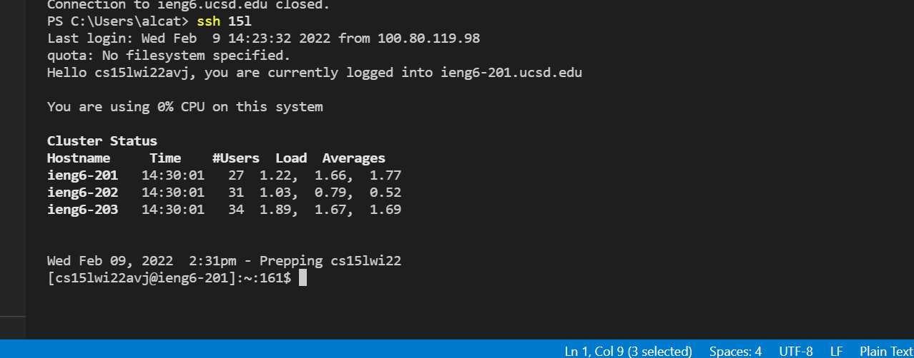
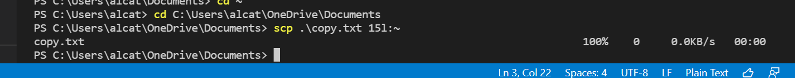

# Lab Report 5
# Streamlining Secure Shell Configuration
## Configuration file with editor


This is the `config` file that is in the secure shell folder. In order to create the `config` file I copied one of the existing files and then renamed it to `config` in addition to giving it the new contents of host and user names to designate what the host name represents, ieng6 in this case. I had to change the username to match my own which was avj.

## Logging into account with chosen alias


I chose the alias 15l so in the `config` file next to the word Host I changed the alias to be 15l. I then only needed to use the command
```
ssh 15l
```
to login to my ieng6 account. This is possible because the `config` file provides the necessary information for the host name.

## Secure copying into account with chosen alias


I was able to use my alias for the ieng6 server to secure copy in addition to secure shelling. All I needed to do was the command
```
scp copy.txt 15l:~
```
in order to secure copy to ieng6 rather than using my username attached to the server. Once again, the `config` file is involved in the process and allows for this to happen.