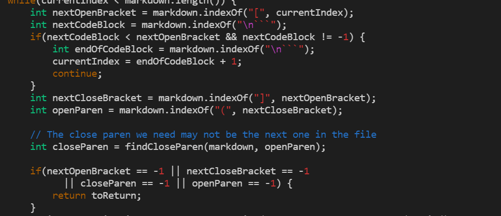

# Lab Report 5
## How I Found the Tests With Different Results

I found the tests with different results by using the `diff` command. More specifically, I redirected the output of a bash file called `script.sh`. It had a for loop for all 652 markdown files that ran the markdown parse program on every single file and then echoed the file name. The output of the bash file script was outputted to a file called `results.txt` and I did the same process for my repositories implementation of the markdown parse program. I then used the `diff` command with these two files which had the output of the bash scripts with their respective `markdownparse` programs which gave me a list of differences which I examined to find the two different tests I have here.

## Test 1
Neither implementation is correct

Other output(top) vs My output(bottom):

Expected Output:
[ti*tle]

For the provided implementation of `markdownparse` the bug is that the program is not checking if there are quotes in the parentheses part of a markdown link. What is wrong with this program is that it needs to be checking for quotes in the parentheses portition of the markdown link and then to only use what is inside of the quotes as the link.

Code that should be fixed:

## Test 2
The provided implementation is correct and my implementation is not correct.

Other output(top) vs My output(bottom):

Expected Output:
[foo(and(bar))]

The bug in my program is that it is only checking for the first found closing parenthesis and not continuing on to make sure there are not more closing parentheses inside of the markdown link. It should be aware of more parentheses than just the closing and opening parentheses because the link gets cut short as shown in this case.

Code to be fixed:

